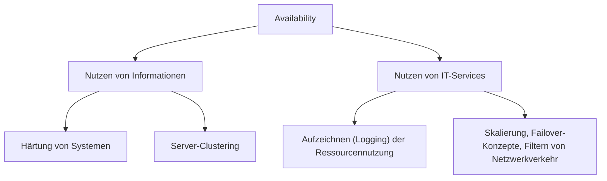

Unter Verfügbarkeit versteht man die Fähigkeit, Informationen oder Services innerhalb eines definierten Zeitfensters (z.B.: Mo-Fr von 7:00 - 18:00) nutzen zu können.

### Wichtige Aspekte der Verfügbarkeit
- **Präventive Planung**: Ein zuverlässiges und sicheres Systemdesign wird im Vorfeld geplant.
- **Safety**: Die Entwicklung eines zuverlässigen Systemdesigns. Beispiele: 
  - Clustering
  - Load-Balancing
  - Redundanz im Netzwerk
- **Sicheres Systemdesign**:
  - Präventive Maßnahmen: SecSDLC, Härtung, Fail-Safe-Default
  - Detektierende Maßnahmen: Normaler vs. anormaler Netzwerktraffic, CPU-Nutzung, NetIO, DiskIO
  - Reaktive Maßnahmen: DDoS-Mitigation, TCP-Port-/IP-Address-Blocking

### Visualisierung

