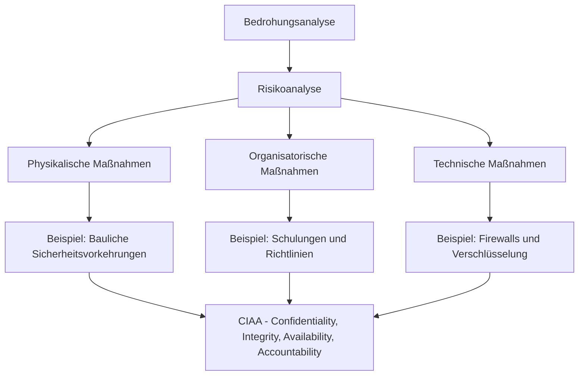
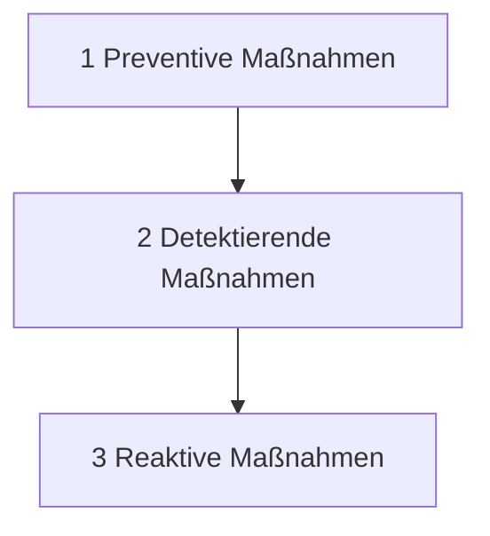

## Traditionelle Datenverarbeitung (ca. 2000)
Bei der traditionellen Datenverarbeitung werden die Daten fast ausschließlich innerhalb eines Unternehmensnetzwerkes (Campus) verarbeitet und konsumiert. Die Daten werden im Unternehmensnetzwerk (im eigenen Rechenzentrum) erzeugt und dort zentral in Speichersystemen gespeichert
![[Pasted image 20250113124050.png]]

In den frühen 2000er-Jahren prägten folgende Entwicklungen die IT-Landschaft:
1. **Internationalisierung**: Ermöglichte eine weltweite Vernetzung durch das Internet.
2. **Digitalisierung**: Führte zur umfassenden Integration von Daten in digitale Systeme und deren Verfügbarkeit über das Internet.
   - **Folge**: Eine stark wachsende Komplexität der Systeme und Sicherheitsanforderungen.

### Übergang zu neuen Sicherheitsansätzen
In dieser Ära wurde klar, dass traditionelle Sicherheitsmaßnahmen unzureichend sind. Das "Zero Trust"-Sicherheitsmodell wurde als Antwort auf die zunehmenden Bedrohungen entwickelt.

### Merkmale des "Zero Trust"-Modells
- **Prinzipien:**
  - Kein automatisches Vertrauen in interne oder externe Netzwerke.
  - Ständige Validierung von Identitäten und Berechtigungen.
- **Methoden:** Security by Design: Sicherheit wird von Anfang an als integraler Bestandteil des Designs berücksichtigt.

## 1. Defense in Depth (Schichtenverteidigung)

Defense in Depth beschreibt ein mehrschichtiges Sicherheitsmodell, das Bedrohungen auf verschiedenen Ebenen adressiert:

### 1. Preventive Maßnahmen
- **Ziel:** Risiken proaktiv minimieren und Schwachstellen frühzeitig beseitigen.
- **Maßnahmen:**
  - Regelmäßiges und zeitnahes Patchen aller IT-Assets, um bekannte Schwachstellen zu schließen.
  - Implementierung eines Schwachstellenmanagements:
    - Überwachung der Einhaltung von Patch-Zeitplänen.
    - Regelmäßige Sicherheitsprüfungen und Risikoanalysen.

### 2. Detektierende Maßnahmen
- **Ziel:** Potenzielle Sicherheitsvorfälle frühzeitig erkennen.
- **Maßnahmen:**
  - **Netzwerkverkehr überwachen:** Analyse und Protokollierung von eingehenden und ausgehenden Datenströmen.
  - **Prozessüberwachung:** Logging von Aktivitäten wie RAM- und CPU-Nutzung.
  - **Zentrale Log-Verwaltung:** Nutzung eines SIEM-Systems (Security Information and Event Management) zur Korrelation und Analyse von Sicherheitsereignissen.

### 3. Reaktive Maßnahmen
- **Ziel:** Schnelle Reaktion auf erkannte Sicherheitsvorfälle.
- **Maßnahmen:**
  - **Firewall:** Blockierung verdächtigen oder unautorisierten Netzwerkverkehrs.
  - **Secure E-Mail-Gateway:** Erkennung und Blockierung von Spam- und Phishing-E-Mails.
  - **Vorfallmanagement:** Definition klarer Prozesse für die Behebung von Sicherheitsvorfällen.

Dieses mehrstufige Sicherheitskonzept stellt sicher, dass Bedrohungen nicht nur abgewehrt, sondern auch frühzeitig erkannt und effektiv bekämpft werden.

![[{D34490F8-1AA7-4E29-9A41-33F78ADFF94E}.png]]