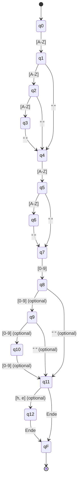

```mermaid
stateDiagram-v2
    [*] --> q0
    q0 --> q1 : [A-Z]
    q1 --> q2 : [A-Z]
    q2 --> q3 : [A-Z]
    q1 --> q4 : " "
    q2 --> q4 : " "
    q3 --> q4 : " "
    q4 --> q5 : [A-Z]
    q5 --> q6 : [A-Z]
    q5 --> q7 : " "
    q6 --> q7 : " "
    q7 --> q8 : [0-9]
    q8 --> q9 : [0-9] (optional)
    q9 --> q10 : [0-9] (optional)
    q10 --> q11 : [0-9] (optional)
    q8 --> q11 : " " (optional)
    q9 --> q11 : " " (optional)
    q11 --> q12 : [h, e] (optional)
    q11 --> qF : Ende
    q12 --> qF : Ende
    qF --> [*]
```