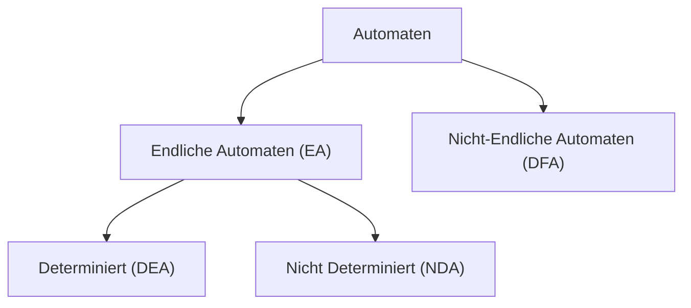

| Automat Definition | Beschreibung |
| ------------------ | ------------ |
| $\sum$             | Eingabe      |
| O                  | Übergänge    |
| Q                  | Alphabet     |
| F                  | Trigger      |
|                    |              |
## Alphabet ($\Sigma$)
> [!Definition] Definition
> Endliche Menge, nicht leer (sonst kein Automat) Menge von Symbolen bzw. Zeichen wie ASCII oder Unicode

> [!Example] Beispiel
> $\Sigma_{Deutsch}$ = {$a, ..., z, ä, ö, ü, ß, ...$}
$\Sigma_{binary}$ = {$0, 1$}
$\Sigma_{Skat}$ = {$\spadesuit, \diamondsuit, \heartsuit, \clubsuit$}
$\Sigma_{directions}$ = {$\rightarrow, \leftarrow, \uparrow, \downarrow$}
$\Sigma_{KFZ-Kennzeichen}$ = {$A, B, C, ..., 1, 2, 3, ...$}

> [!Important] Wichtig
> A1 kann nicht in einem Alphabet vorkommen, sondern wäre dann ein Wort aus dem Alphabet KFZ-Kennzeichen

## Wörter
### Definitionen

1. Sei $\Sigma^*$ die Menge aller Wörter über dem Alphabet, inklusive des leeren Wortes $\varepsilon$ (auch "" geschrieben)
2. Sei $\Sigma^+$ definiert als $\Sigma^*$ ohne das leere Wort $\varepsilon$
3. Sei $\varepsilon$ das leere Wort (auch als "" dargestellt)
4. Für ein Wort $w$ gilt:
    - $w$ bezeichnet ein Wort
    - $|w|$ bezeichnet die Länge des Wortes $w$
    - $\Sigma^n = {w \mid w \text{ ist Wort über } \Sigma, |w| = n}$

## Spezialfall: Binäres Alphabet

Für das binäre Alphabet $\Sigma_{binär} = {0,1}$ gilt:

- $\Sigma_{binär}^* = {0, 01, 10, 001, ...}$ (Kleene-Stern)
- $\Sigma_{(0,1)}$ bezeichnet das binäre Alphabet

## Zusätzliche Notation

$\Sigma^+ = \Sigma^* - {\varepsilon}$

## Language
L : Language
$L \leq \sum^*$ -> Die Sprache ist eine Teilmenge eines Alphabetes. Da in Deutsch, nicht alle Wörter verwendet werde, welche möglich werden
### Beispiel
- Gerade Binar Zahlen Sprache
	- $\Sigma_{geradebinärzahl}^* = {0, 10, ...}$
- Sprache als Menge über $\Sigma_{binär}$ , nur Worte, die keine zwei aufeinanderfolgenden '1' enthalten
	- $L = {0,1,00,001,100,101,0000, 0001, 0010, 0100, 0101, 1010}$
- $L_0$ = 0 -> "echte leere Sprache" enthält kein einziges Wort
- $L_\varepsilon = \varepsilon$ Enthält nur das leere Wort
- 

