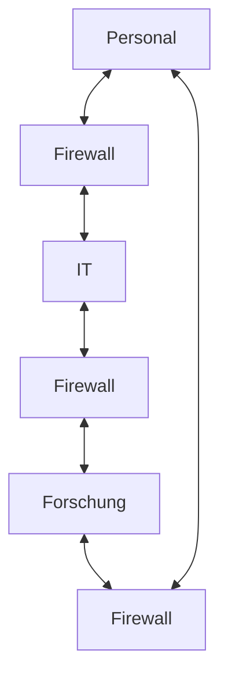
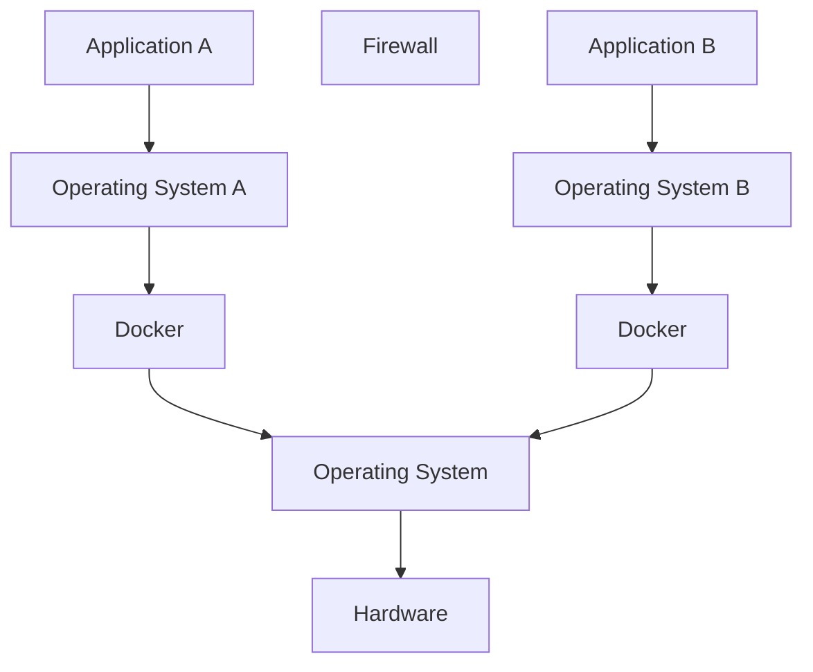

> [!IMPORTANT]
> Das **Least Common Mechanism**-Prinzip ist ein wichtiges Sicherheitsprinzip, das darauf abzielt, den gemeinsamen Zugriff auf Ressourcen zu minimieren, um unberechtigte Informationsflüsse zu verhindern.

### Grundprinzip
**Least Common Mechanism (Isolation)**: Zugriffskanäle auf Ressourcen sollten nicht zwischen unterschiedlichen IT-Assets (User, Devices, etc.) geteilt ("shared") werden.

### Erläuterung

> [!WARNING]
> Die gemeinsame Nutzung von Ressourcen stellt einen geteilten Kanal (shared channel) dar, über den Informationen unberechtigt gelesen, verändert oder sogar blockiert werden können. Diese geteilten Ressourcen können als covert channels oder side channels fungieren.

### Anwendung

Das Prinzip der Isolation (Segmentierung) kann in verschiedenen Kontexten angewendet werden:

> [!TIP]
> 1. **Öffentlich zugängliche Systeme**: Diese müssen von kritischen Ressourcen (Daten, Prozesse usw.) isoliert werden, um die Offenlegung oder Manipulation zu verhindern.
> 2. **Zugriffssteuerung**: Reduktion der Anzahl der Systeme und Benutzer, die Zugriff auf sensitive Daten und kritische Systeme erhalten sollen.
> 3. **Trennung von Prozessen und Daten**: Prozesse und Daten mit unterschiedlichen Sicherheitsanforderungen sollten voneinander isoliert werden.

> [!EXAMPLE]-
> Ein gehackter Webserver, der Zugriff auf das lokale Netzwerk ermöglicht, zeigt, wie wichtig die Trennung von öffentlich zugänglichen Systemen und internen Netzwerken ist.

#### Benutzer

#### Applikationen
