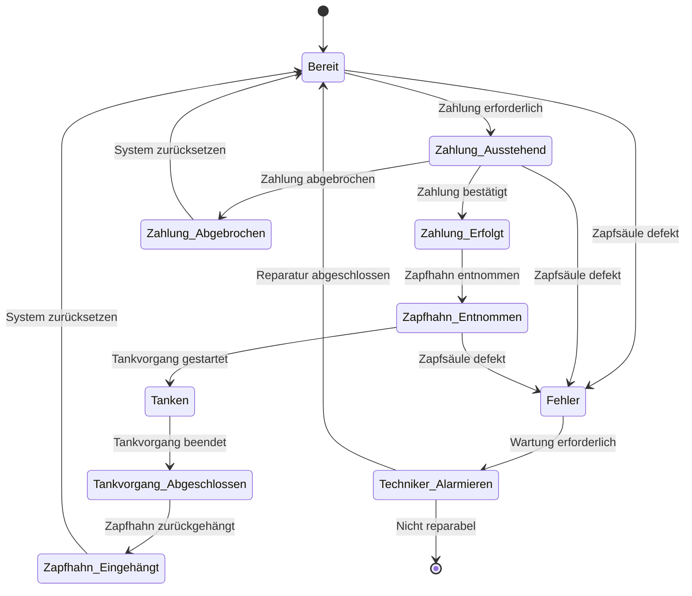

```mermaid
stateDiagram
    [*] --> Bereit
    Bereit --> Zahlung_Ausstehend: Zahlung erforderlich
    Zahlung_Ausstehend --> Zahlung_Erfolgt: Zahlung bestätigt
    Zahlung_Ausstehend --> Zahlung_Abgebrochen: Zahlung abgebrochen
    Zahlung_Abgebrochen --> Bereit: System zurücksetzen
    Zahlung_Erfolgt --> Zapfhahn_Entnommen: Zapfhahn entnommen
    Zapfhahn_Entnommen --> Tanken: Tankvorgang gestartet
    Tanken --> Tankvorgang_Abgeschlossen: Tankvorgang beendet
    Tankvorgang_Abgeschlossen --> Zapfhahn_Eingehängt: Zapfhahn zurückgehängt
    Zapfhahn_Eingehängt --> Bereit: System zurücksetzen
    Bereit --> Fehler: Zapfsäule defekt
    Zahlung_Ausstehend --> Fehler: Zapfsäule defekt
    Zapfhahn_Entnommen --> Fehler: Zapfsäule defekt
    Fehler --> Techniker_Alarmieren: Wartung erforderlich
    Techniker_Alarmieren --> Bereit: Reparatur abgeschlossen
    Techniker_Alarmieren --> [*]: Nicht reparabel
```